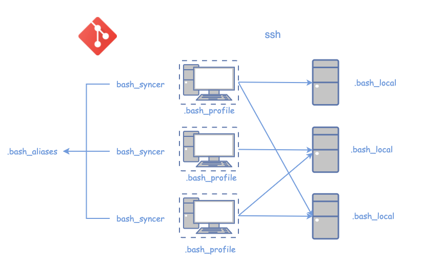
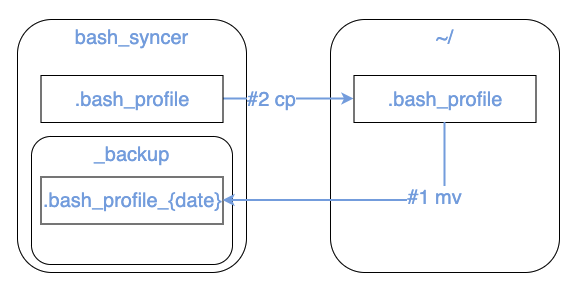

# bash_syncer

```
git clone git@github.com:p-geon/bash_syncer.git
cd bash_syncer
make init
```

- for bash (`make init`)
- for zsh (`make init-zsh`)
- `.bashrc`/`.zshrc` が空の場合、
  - `mv bash/.bashrc ~/.bashrc`
  - `mv bash/.zshrc ~/.zshrc`

## 自動更新

bashにログインすると~/.bash_profileから自動でシェルすくリプトが起動する。

## 手動更新

シェルスクリプトを動かす部分を修正した場合は手動で更新する必要あり。

```
S 
make init
reload
```

## Overview

実は結構違う





## Main Command

reloader

- `SET` && `RR`

search

- `A | grep {command}`
    - = `SS {command}`
